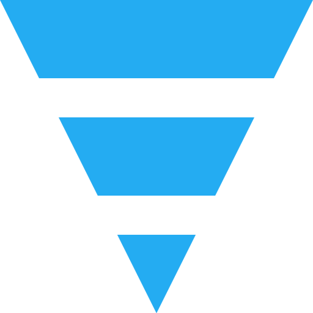

#  Caliban.Nano
[)](https://dev.azure.com/cuhsat/Caliban.Nano)
[](https://www.nuget.org/packages/Caliban.Nano)

A very tiny, but very powerful MVVM .NET 6 framework, using convenience over configuration with no further dependencies.

# How to get
Latest package available over [nuget](https://www.nuget.org/packages/Caliburn.Micro/).

```powershell
PM> Install-Package Caliban.Nano
```

# How to start
The fastest way to get started, is to take a look at the [Hello Project](samples/Caliban.Nano.Hello/) included, showing most of the frameworks features.

# Features

## Dependency Injection
Compose your app with loosely coupled objects that will inject by creation.

### Constructors

```cs
public IBattery Battery { get; init; }

public Remote(IBattery battery)
{
    Battery = battery;
}
```

### Properties
```cs
public IBattery? Battery { get; set; }
```

## Event Aggregating
Communicate between view models with event aggregating.

```cs
public class Remote
{
    public Remote(IEventAggregator events)
    {
        events.Publish(new BatteryLowEvent());
    }
}
```

```cs
public class Display : IHandle<BatteryLowEvent>
{
    public Display(IEventAggregator events)
    {
        events.Subscribe<BatteryLowEvent>(this);
    }

    public void Handle(BatteryLowEvent event)
    {
        ...
    }
}
```

## Automatic Binding
Apply methods and properties between your view and view model automatically and guard them.

### Methods
```xml
<Button x:Name="DoSomething"/>
```

```cs
public bool CanDoSomething => true;

public void DoSomething()
{
    ...
}
```

### Properties
```xml
<TextBox x:Name="SomeInput"/>
```

```cs
private string _someInput = "";

public string SomeInput
{
    get => _someInput;
    set
    {
        _someInput = value;

        NotifyPropertyChanged();
    }
}
```

## Conductor Composition
Decouple view models with the built in composition pattern.

```xml
<ContentControl x:Name="ActiveItem"/>
```

```cs
public CompanyViewModel() : ViewModel
{
    LoadUserAsync();
}

public async void LoadUserAsync()
{
    await Activate(new UserViewModel());
}
```

## View \ ViewModel Matching
Match your views and view models automatically by consistent naming alone.

```cs
public class MainView
{
    ...
}
```

```cs
public class MainViewModel
{
    ...
}
```

## Service Locator
Use registered services with the supplied service locator.

```cs
new Bootstrap().Register<ILogger>(new Logger());
```

```cs
var log = IoC.Get<ILogger>();
```

---

This work is heavily inspired by the [Caliburn.Micro](https://caliburnmicro.com) framework. Which is one of the nicest frameworks, I had the pleasure to use. It is also named the after the character *Caliban* in Shakespeare's play *The Tempest* (hence the projects symbol). As the writer Russell Hoban put it:

> Caliban is one of the hungry ideas, he's always looking for someone to word him into being ... Caliban is a necessary idea.

Which seems fitting.